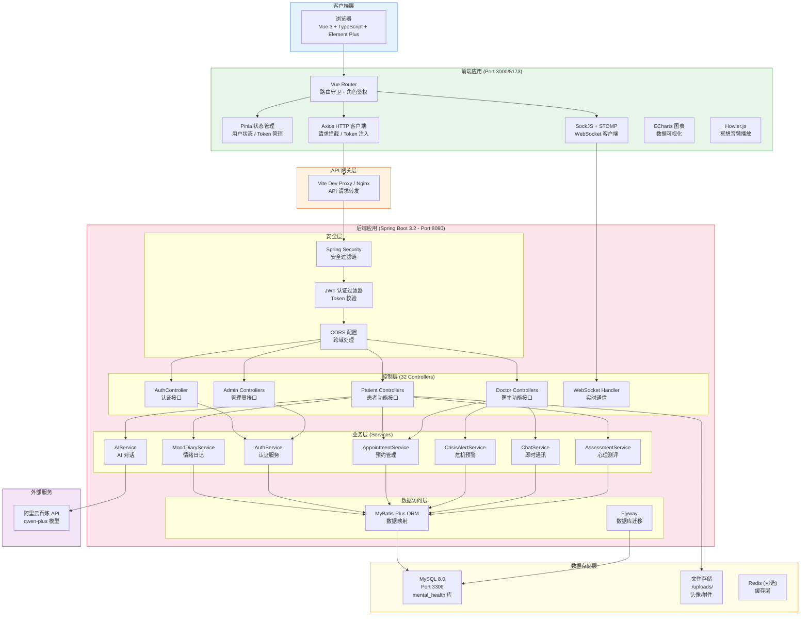

# 系统架构总览

## 整体架构图

## 技术栈速览

| 层级 | 技术 | 版本 |
|------|------|------|
| 前端框架 | Vue 3 + TypeScript | 3.4 / 5.3 |
| UI 组件库 | Element Plus | 2.5 |
| 状态管理 | Pinia | 2.1.7 |
| 构建工具 | Vite | 5.0 |
| 后端框架 | Spring Boot | 3.2.0 |
| ORM | MyBatis-Plus | 3.5.5 |
| 安全 | Spring Security + JWT | - |
| 数据库 | MySQL | 8.0 |
| AI | 阿里云百炼 (qwen-plus) | - |
| 实时通信 | WebSocket (STOMP) | - |
