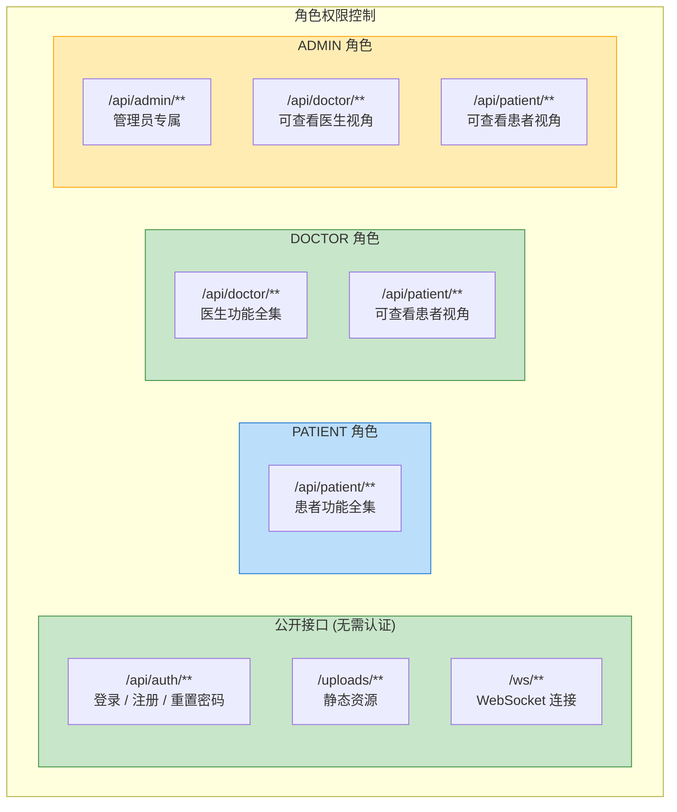

# 用户角色与功能模块图

## 三角色功能全景

```mermaid
graph LR
    subgraph 系统["智能心理健康管理系统"]
        direction TB

        subgraph 患者模块["患者模块 (PATIENT)"]
            direction TB
            P_Dashboard["仪表盘<br/>情绪趋势 / 推荐"]
            P_Mood["情绪日记<br/>多维评分 / 天气主题"]
            P_Capsule["时光信箱<br/>写给未来的信"]
            P_Tree["树洞<br/>匿名倾诉社区"]
            P_Room["房间装饰<br/>个性化空间"]
            P_AI["AI 心理顾问<br/>智能问答"]
            P_Assess["心理测评<br/>量表评估"]
            P_Meditate["冥想练习<br/>引导式放松"]
            P_Resource["学习资源<br/>文章 / 指南"]
            P_Doctor["查找医生<br/>浏览 / 预约"]
            P_Chat["实时聊天<br/>与医生沟通"]
            P_Appoint["预约管理<br/>排期 / 取消"]
            P_Report["健康报告<br/>评估结果"]
            P_Profile["个人信息<br/>档案管理"]
        end

        subgraph 医生模块["医生模块 (DOCTOR)"]
            direction TB
            D_Dashboard["工作台<br/>统计 / 概览"]
            D_Patients["患者管理<br/>列表 / 详情"]
            D_Pool["患者池<br/>认领新患者"]
            D_Consult["咨询会话<br/>在线咨询"]
            D_Crisis["危机预警<br/>紧急警报"]
            D_Appoint["预约管理<br/>确认 / 完成"]
            D_Schedule["排班设置<br/>时间段配置"]
            D_Plan["治疗方案<br/>制定 / 跟踪"]
            D_Report["患者报告<br/>评估分析"]
            D_Chat["患者沟通<br/>即时消息"]
            D_Profile["执业信息<br/>资质管理"]
        end

        subgraph 管理模块["管理员模块 (ADMIN)"]
            direction TB
            A_Dashboard["系统概览<br/>全局统计"]
            A_Users["用户管理<br/>启用 / 禁用"]
            A_Doctors["医生审核<br/>资质审批"]
            A_Assign["分配审批<br/>患者-医生关系"]
            A_Appoint["预约监管<br/>全局预约"]
            A_Resource["内容管理<br/>资源 / 文章"]
            A_Message["系统公告<br/>通知推送"]
            A_Settings["系统配置<br/>参数设置"]
        end
    end

    style 患者模块 fill:#E3F2FD,stroke:#1565C0
    style 医生模块 fill:#E8F5E9,stroke:#2E7D32
    style 管理模块 fill:#FFF3E0,stroke:#E65100
```



## 角色权限矩阵



## 前端路由结构

```
/                           → 重定向到 /patient
├── /login                  → 登录页
├── /register               → 注册页
├── /forgot-password        → 找回密码
│
├── /patient/               → 患者布局 (PatientLayout)
│   ├── dashboard           → 个人仪表盘
│   ├── mood-diary          → 情绪日记
│   ├── time-capsule        → 时光信箱
│   ├── tree-hole           → 树洞社区
│   ├── room-decoration     → 房间装饰
│   ├── ai-chat             → AI 对话
│   ├── assessments         → 心理测评
│   ├── meditation          → 冥想练习
│   ├── resources           → 学习资源
│   ├── doctors             → 查找医生
│   ├── chat                → 在线聊天
│   ├── appointments        → 预约管理
│   ├── reports             → 健康报告
│   ├── communication       → 通讯中心
│   └── profile             → 个人信息
│
├── /doctor/                → 医生布局 (DoctorLayout)
│   ├── dashboard           → 工作台
│   ├── patients            → 患者管理
│   ├── patient-pool        → 患者池
│   ├── consultations       → 咨询会话
│   ├── crisis-alerts       → 危机预警
│   ├── appointments        → 预约管理
│   ├── scheduling          → 排班设置
│   ├── treatment-plans     → 治疗方案
│   ├── reports             → 患者报告
│   ├── chat                → 患者沟通
│   └── profile             → 执业信息
│
└── /admin/                 → 管理员布局 (AdminLayout)
    ├── dashboard           → 系统概览
    ├── users               → 用户管理
    ├── doctors             → 医生审核
    ├── appointments        → 预约监管
    ├── resources           → 内容管理
    ├── statistics          → 数据统计
    ├── messages            → 系统公告
    └── settings            → 系统配置
```
