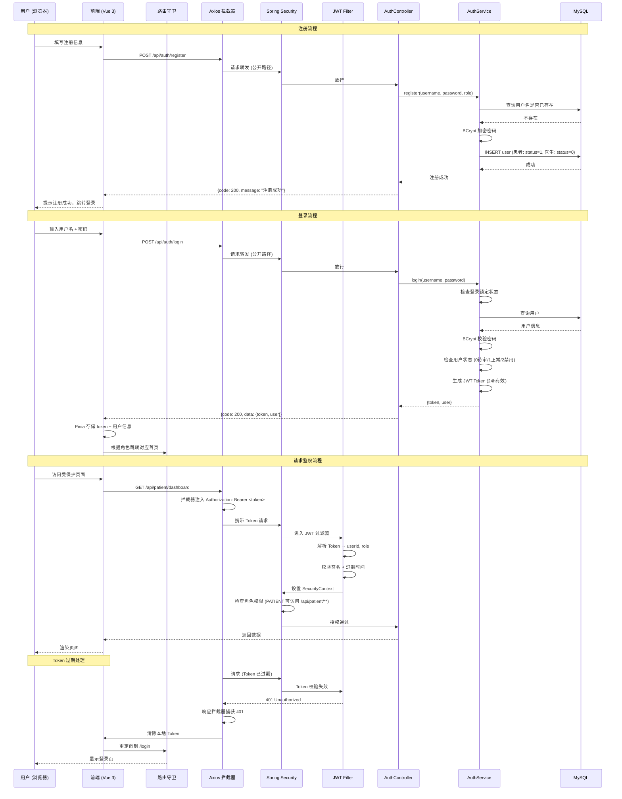
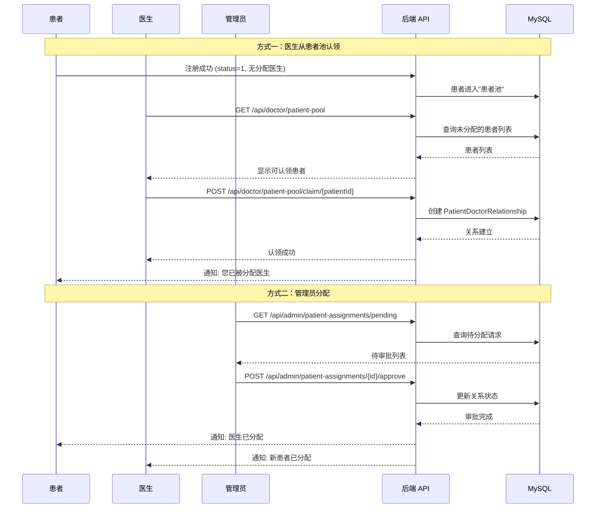
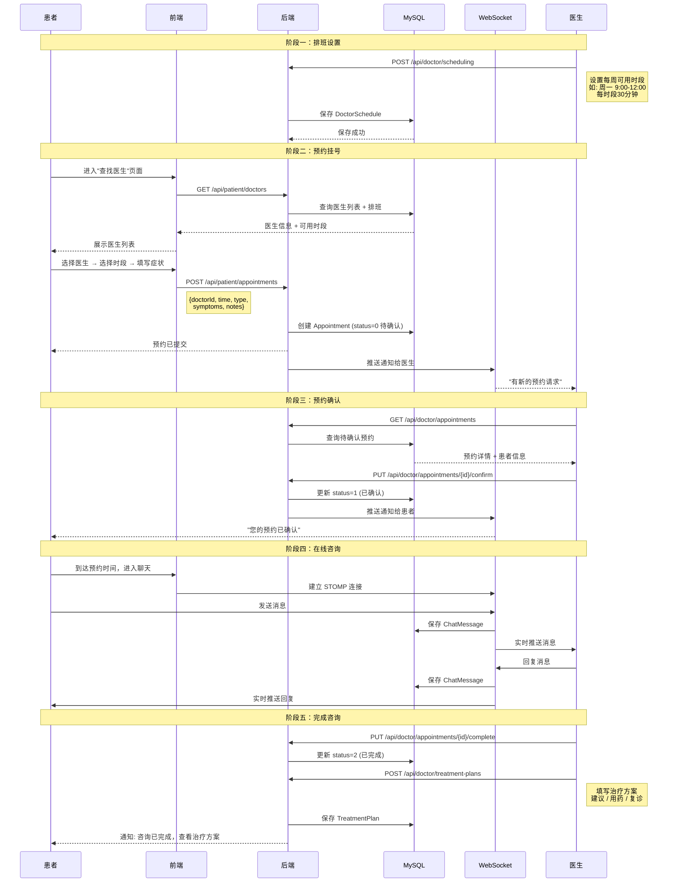
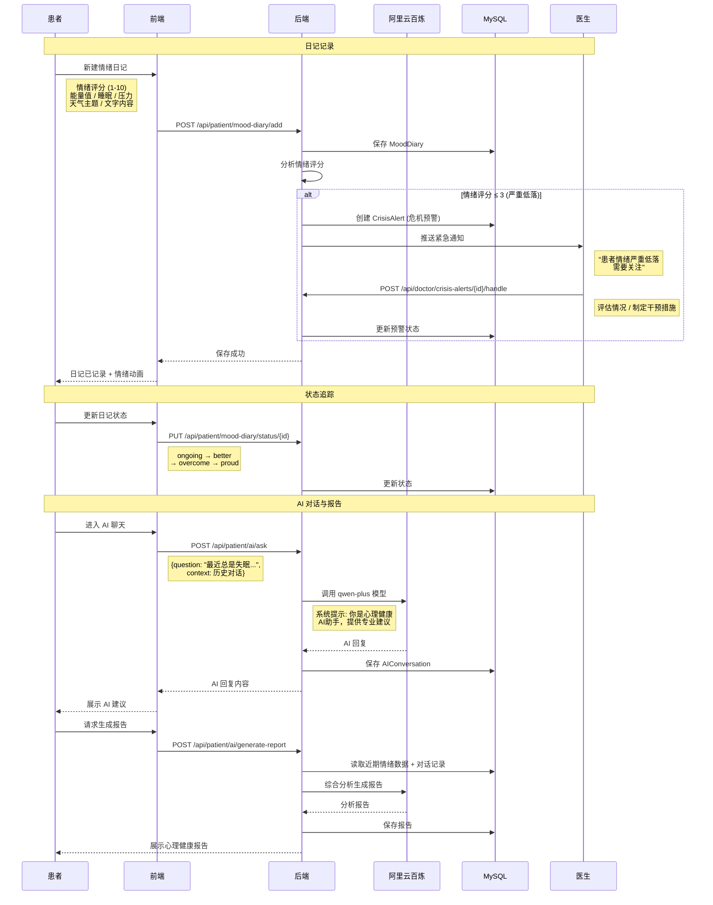
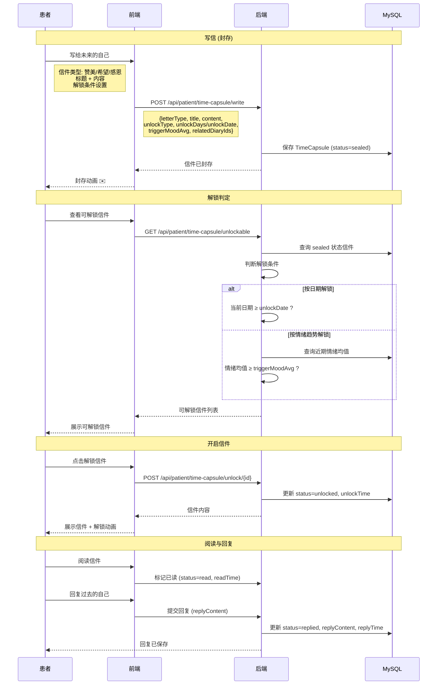

# 核心业务流程图

## 1. 用户认证流程

```mermaid
sequenceDiagram
    participant U as 用户 (浏览器)
    participant F as 前端 (Vue 3)
    participant G as 路由守卫
    participant A as Axios 拦截器
    participant S as Spring Security
    participant JWT as JWT Filter
    participant C as AuthController
    participant Svc as AuthService
    participant DB as MySQL

    Note over U,DB: 注册流程
    U->>F: 填写注册信息
    F->>A: POST /api/auth/register
    A->>S: 请求转发 (公开路径)
    S->>C: 放行
    C->>Svc: register(username, password, role)
    Svc->>DB: 查询用户名是否已存在
    DB-->>Svc: 不存在
    Svc->>Svc: BCrypt 加密密码
    Svc->>DB: INSERT user (患者: status=1, 医生: status=0)
    DB-->>Svc: 成功
    Svc-->>C: 注册成功
    C-->>F: {code: 200, message: "注册成功"}
    F-->>U: 提示注册成功，跳转登录

    Note over U,DB: 登录流程
    U->>F: 输入用户名 + 密码
    F->>A: POST /api/auth/login
    A->>S: 请求转发 (公开路径)
    S->>C: 放行
    C->>Svc: login(username, password)
    Svc->>Svc: 检查登录锁定状态
    Svc->>DB: 查询用户
    DB-->>Svc: 用户信息
    Svc->>Svc: BCrypt 校验密码
    Svc->>Svc: 检查用户状态 (0待审/1正常/2禁用)
    Svc->>Svc: 生成 JWT Token (24h有效)
    Svc-->>C: {token, user}
    C-->>F: {code: 200, data: {token, user}}
    F->>F: Pinia 存储 token + 用户信息
    F->>G: 根据角色跳转对应首页

    Note over U,DB: 请求鉴权流程
    U->>F: 访问受保护页面
    F->>A: GET /api/patient/dashboard
    A->>A: 拦截器注入 Authorization: Bearer <token>
    A->>S: 携带 Token 请求
    S->>JWT: 进入 JWT 过滤器
    JWT->>JWT: 解析 Token → userId, role
    JWT->>JWT: 校验签名 + 过期时间
    JWT->>S: 设置 SecurityContext
    S->>S: 检查角色权限 (PATIENT 可访问 /api/patient/**)
    S->>C: 授权通过
    C-->>F: 返回数据
    F-->>U: 渲染页面

    Note over U,F: Token 过期处理
    A->>S: 请求 (Token 已过期)
    S->>JWT: Token 校验失败
    JWT-->>A: 401 Unauthorized
    A->>A: 响应拦截器捕获 401
    A->>F: 清除本地 Token
    F->>G: 重定向到 /login
    G-->>U: 显示登录页
```

## 2. 患者-医生关系建立流程

```mermaid
sequenceDiagram
    participant P as 患者
    participant D as 医生
    participant Admin as 管理员
    participant API as 后端 API
    participant DB as MySQL

    Note over P,DB: 方式一：医生从患者池认领
    P->>API: 注册成功 (status=1, 无分配医生)
    API->>DB: 患者进入"患者池"
    D->>API: GET /api/doctor/patient-pool
    API->>DB: 查询未分配的患者列表
    DB-->>API: 患者列表
    API-->>D: 显示可认领患者
    D->>API: POST /api/doctor/patient-pool/claim/{patientId}
    API->>DB: 创建 PatientDoctorRelationship
    DB-->>API: 关系建立
    API-->>D: 认领成功
    API-->>P: 通知: 您已被分配医生

    Note over P,DB: 方式二：管理员分配
    Admin->>API: GET /api/admin/patient-assignments/pending
    API->>DB: 查询待分配请求
    DB-->>Admin: 待审批列表
    Admin->>API: POST /api/admin/patient-assignments/{id}/approve
    API->>DB: 更新关系状态
    DB-->>API: 审批完成
    API-->>P: 通知: 医生已分配
    API-->>D: 通知: 新患者已分配
```

## 3. 预约与咨询全流程

```mermaid
sequenceDiagram
    participant P as 患者
    participant F as 前端
    participant API as 后端
    participant DB as MySQL
    participant WS as WebSocket
    participant D as 医生

    Note over P,D: 阶段一：排班设置
    D->>API: POST /api/doctor/scheduling
    Note right of D: 设置每周可用时段<br/>如: 周一 9:00-12:00<br/>每时段30分钟
    API->>DB: 保存 DoctorSchedule
    DB-->>API: 保存成功

    Note over P,D: 阶段二：预约挂号
    P->>F: 进入"查找医生"页面
    F->>API: GET /api/patient/doctors
    API->>DB: 查询医生列表 + 排班
    DB-->>F: 医生信息 + 可用时段
    F-->>P: 展示医生列表
    P->>F: 选择医生 → 选择时段 → 填写症状
    F->>API: POST /api/patient/appointments
    Note right of F: {doctorId, time, type,<br/>symptoms, notes}
    API->>DB: 创建 Appointment (status=0 待确认)
    API-->>P: 预约已提交
    API->>WS: 推送通知给医生
    WS-->>D: "有新的预约请求"

    Note over P,D: 阶段三：预约确认
    D->>API: GET /api/doctor/appointments
    API->>DB: 查询待确认预约
    DB-->>D: 预约详情 + 患者信息
    D->>API: PUT /api/doctor/appointments/{id}/confirm
    API->>DB: 更新 status=1 (已确认)
    API->>WS: 推送通知给患者
    WS-->>P: "您的预约已确认"

    Note over P,D: 阶段四：在线咨询
    P->>F: 到达预约时间，进入聊天
    F->>WS: 建立 STOMP 连接
    P->>WS: 发送消息
    WS->>DB: 保存 ChatMessage
    WS->>D: 实时推送消息
    D->>WS: 回复消息
    WS->>DB: 保存 ChatMessage
    WS->>P: 实时推送回复

    Note over P,D: 阶段五：完成咨询
    D->>API: PUT /api/doctor/appointments/{id}/complete
    API->>DB: 更新 status=2 (已完成)
    D->>API: POST /api/doctor/treatment-plans
    Note right of D: 填写治疗方案<br/>建议 / 用药 / 复诊
    API->>DB: 保存 TreatmentPlan
    API-->>P: 通知: 咨询已完成，查看治疗方案
```

## 4. 情绪日记 + AI 分析 + 危机预警

```mermaid
sequenceDiagram
    participant P as 患者
    participant F as 前端
    participant API as 后端
    participant AI as 阿里云百炼
    participant DB as MySQL
    participant D as 医生

    Note over P,D: 日记记录
    P->>F: 新建情绪日记
    Note right of P: 情绪评分 (1-10)<br/>能量值 / 睡眠 / 压力<br/>天气主题 / 文字内容
    F->>API: POST /api/patient/mood-diary/add
    API->>DB: 保存 MoodDiary
    API->>API: 分析情绪评分

    alt 情绪评分 ≤ 3 (严重低落)
        API->>DB: 创建 CrisisAlert (危机预警)
        API->>D: 推送紧急通知
        Note right of D: "患者情绪严重低落<br/>需要关注"
        D->>API: POST /api/doctor/crisis-alerts/{id}/handle
        Note right of D: 评估情况 / 制定干预措施
        API->>DB: 更新预警状态
    end

    API-->>F: 保存成功
    F-->>P: 日记已记录 + 情绪动画

    Note over P,D: 状态追踪
    P->>F: 更新日记状态
    F->>API: PUT /api/patient/mood-diary/status/{id}
    Note right of F: ongoing → better<br/>→ overcome → proud
    API->>DB: 更新状态

    Note over P,D: AI 对话与报告
    P->>F: 进入 AI 聊天
    F->>API: POST /api/patient/ai/ask
    Note right of F: {question: "最近总是失眠...",<br/>context: 历史对话}
    API->>AI: 调用 qwen-plus 模型
    Note right of API: 系统提示: 你是心理健康<br/>AI助手，提供专业建议
    AI-->>API: AI 回复
    API->>DB: 保存 AIConversation
    API-->>F: AI 回复内容
    F-->>P: 展示 AI 建议

    P->>F: 请求生成报告
    F->>API: POST /api/patient/ai/generate-report
    API->>DB: 读取近期情绪数据 + 对话记录
    API->>AI: 综合分析生成报告
    AI-->>API: 分析报告
    API->>DB: 保存报告
    API-->>P: 展示心理健康报告
```

## 5. 时光信箱流程

```mermaid
sequenceDiagram
    participant P as 患者
    participant F as 前端
    participant API as 后端
    participant DB as MySQL

    Note over P,DB: 写信 (封存)
    P->>F: 写给未来的自己
    Note right of P: 信件类型: 赞美/希望/感恩<br/>标题 + 内容<br/>解锁条件设置
    F->>API: POST /api/patient/time-capsule/write
    Note right of F: {letterType, title, content,<br/>unlockType, unlockDays/unlockDate,<br/>triggerMoodAvg, relatedDiaryIds}
    API->>DB: 保存 TimeCapsule (status=sealed)
    API-->>F: 信件已封存
    F-->>P: 封存动画 ✉️

    Note over P,DB: 解锁判定
    P->>F: 查看可解锁信件
    F->>API: GET /api/patient/time-capsule/unlockable
    API->>DB: 查询 sealed 状态信件
    API->>API: 判断解锁条件

    alt 按日期解锁
        API->>API: 当前日期 ≥ unlockDate ?
    else 按情绪趋势解锁
        API->>DB: 查询近期情绪均值
        API->>API: 情绪均值 ≥ triggerMoodAvg ?
    end

    API-->>F: 可解锁信件列表
    F-->>P: 展示可解锁信件

    Note over P,DB: 开启信件
    P->>F: 点击解锁信件
    F->>API: POST /api/patient/time-capsule/unlock/{id}
    API->>DB: 更新 status=unlocked, unlockTime
    API-->>F: 信件内容
    F-->>P: 展示信件 + 解锁动画

    Note over P,DB: 阅读与回复
    P->>F: 阅读信件
    F->>API: 标记已读 (status=read, readTime)
    P->>F: 回复过去的自己
    F->>API: 提交回复 (replyContent)
    API->>DB: 更新 status=replied, replyContent, replyTime
    API-->>P: 回复已保存
```
