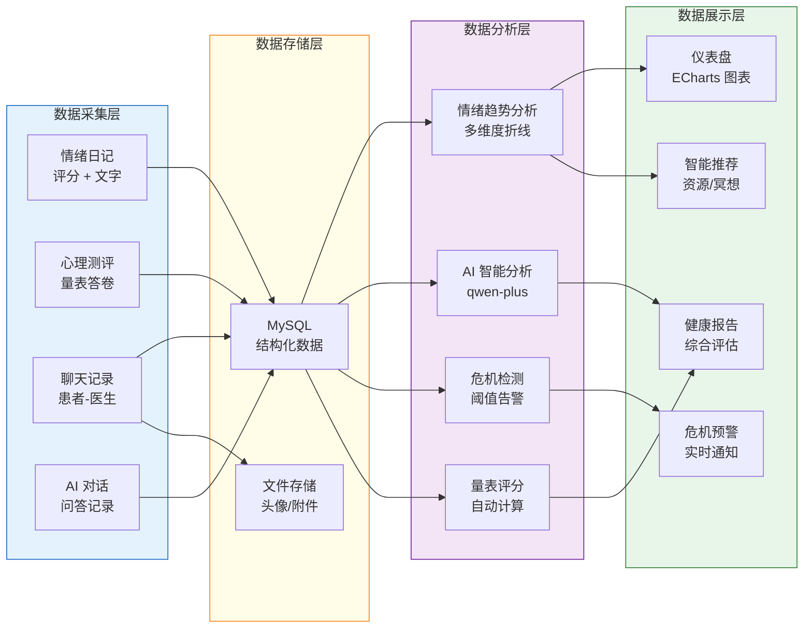

# 数据模型关系图

## 核心实体关系图 (ER Diagram)

```mermaid
erDiagram
    User ||--o| PatientProfile : "1:1 患者档案"
    User ||--o{ MoodDiary : "1:N 写日记"
    User ||--o{ TimeCapsule : "1:N 写信"
    User ||--o{ TreeHolePost : "1:N 发帖"
    User ||--o{ AIConversation : "1:N AI对话"
    User ||--o{ MeditationSession : "1:N 冥想记录"
    User ||--o{ Notification : "1:N 收通知"
    User ||--o{ DecorationConfig : "1:N 房间配置"

    User ||--o{ PatientDoctorRelationship : "患者关系"
    User ||--o{ PatientDoctorRelationship : "医生关系"

    User ||--o{ Appointment : "患者预约"
    User ||--o{ Appointment : "医生预约"
    User ||--o{ DoctorSchedule : "医生排班"

    User ||--o{ ChatMessage : "发消息"
    User ||--o{ ChatMessage : "收消息"

    User ||--o{ CrisisAlert : "患者预警"
    User ||--o{ CrisisAlert : "医生处理"

    User ||--o{ AssessmentRecord : "做测评"
    AssessmentScale ||--o{ ScaleQuestion : "1:N 量表题目"
    AssessmentScale ||--o{ AssessmentRecord : "1:N 测评记录"

    User {
        bigint id PK
        varchar username UK
        varchar password
        varchar nickname
        varchar avatar
        varchar phone
        varchar email
        enum gender
        int age
        enum role "PATIENT/DOCTOR/ADMIN"
        varchar specialization "医生专长"
        int status "0待审/1正常/2禁用"
        int deleted "逻辑删除"
        datetime createTime
        datetime updateTime
    }

    PatientProfile {
        bigint id PK
        bigint userId FK
        varchar realName
        date birthDate
        varchar maritalStatus
        varchar occupation
        varchar emergencyContactName
        varchar emergencyContactPhone
        varchar emergencyContactRelation
        text medicalHistory
        text allergyHistory
        text familyHistory
        json consentFlags
        json intakeTags
        int profileVersion
    }

    MoodDiary {
        bigint id PK
        bigint userId FK
        int moodScore "1-10"
        varchar moodEmoji
        varchar title
        text content
        int energyLevel
        int sleepQuality
        int stressLevel
        varchar weatherType "天气主题"
        json weatherConfig
        enum status "ongoing/better/overcome/proud"
        datetime statusUpdateTime
        int viewCount
        int commentCount
        datetime createTime
    }

    TimeCapsule {
        bigint id PK
        bigint userId FK
        enum letterType "praise/hope/thanks"
        varchar title
        text content
        float triggerMoodAvg "解锁情绪阈值"
        varchar triggerMoodTrend
        json relatedDiaryIds
        date writeDate
        date unlockDate
        int unlockDays
        varchar unlockType
        json unlockConditions
        enum status "sealed/unlocked/read/replied"
        datetime unlockTime
        datetime readTime
        text replyContent
        datetime replyTime
    }

    Appointment {
        bigint id PK
        bigint patientId FK
        bigint doctorId FK
        enum appointmentType "CONSULTATION/THERAPY/REVIEW"
        datetime appointmentTime
        int duration "分钟"
        int status "0待确认/1已确认/2已完成/3已取消/4已过期"
        text symptoms
        text notes
        varchar cancelReason
        datetime confirmTime
        datetime completeTime
        boolean reminderSent
    }

    DoctorSchedule {
        bigint id PK
        bigint doctorId FK
        int dayOfWeek "1-7"
        time startTime
        time endTime
        int slotDuration "分钟"
        int maxPatients
        varchar location
        boolean active
    }

    ChatMessage {
        bigint id PK
        bigint senderId FK
        bigint receiverId FK
        text content
        varchar messageType "text/image/file"
        boolean isRead
        datetime createTime
    }

    CrisisAlert {
        bigint id PK
        bigint patientId FK
        bigint doctorId FK
        varchar alertType
        varchar severity
        text description
        varchar status "pending/handling/resolved"
        text handleNote
        datetime handleTime
        datetime createTime
    }

    AIConversation {
        bigint id PK
        bigint userId FK
        text question
        text answer
        text context
        varchar feedback
        datetime createTime
    }

    AssessmentScale {
        bigint id PK
        varchar scaleCode UK
        varchar scaleName
        varchar version
        varchar scaleType
        text introText
        json scoringRule
        json interpretationRule
        boolean active
        int estimatedMinutes
    }

    AssessmentRecord {
        bigint id PK
        bigint userId FK
        bigint scaleId FK
        json answers
        int totalScore
        varchar resultLevel
        text interpretation
        datetime createTime
    }

    PatientDoctorRelationship {
        bigint id PK
        bigint patientId FK
        bigint doctorId FK
        varchar status
        datetime createTime
    }

    Notification {
        bigint id PK
        bigint userId FK
        varchar type
        varchar title
        text content
        boolean isRead
        datetime createTime
    }

    DecorationConfig {
        bigint id PK
        bigint userId FK
        json themeConfig
        json furnitureList
        json wallpaperConfig
        datetime updateTime
    }
```

## 数据流向图

```mermaid
flowchart LR
    subgraph 数据采集["数据采集层"]
        Mood["情绪日记<br/>评分 + 文字"]
        Assess["心理测评<br/>量表答卷"]
        Chat2["聊天记录<br/>患者-医生"]
        AIChat["AI 对话<br/>问答记录"]
    end

    subgraph 数据存储["数据存储层"]
        MySQL2["MySQL<br/>结构化数据"]
        Files["文件存储<br/>头像/附件"]
    end

    subgraph 数据分析["数据分析层"]
        MoodTrend["情绪趋势分析<br/>多维度折线"]
        AIAnalysis["AI 智能分析<br/>qwen-plus"]
        CrisisDetect["危机检测<br/>阈值告警"]
        ScoreCalc["量表评分<br/>自动计算"]
    end

    subgraph 数据展示["数据展示层"]
        Dashboard["仪表盘<br/>ECharts 图表"]
        Report["健康报告<br/>综合评估"]
        Alert["危机预警<br/>实时通知"]
        Recommend["智能推荐<br/>资源/冥想"]
    end

    Mood --> MySQL2
    Assess --> MySQL2
    Chat2 --> MySQL2
    AIChat --> MySQL2
    Chat2 --> Files

    MySQL2 --> MoodTrend
    MySQL2 --> AIAnalysis
    MySQL2 --> CrisisDetect
    MySQL2 --> ScoreCalc

    MoodTrend --> Dashboard
    AIAnalysis --> Report
    CrisisDetect --> Alert
    ScoreCalc --> Report
    MoodTrend --> Recommend

    style 数据采集 fill:#E3F2FD,stroke:#1565C0
    style 数据存储 fill:#FFFDE7,stroke:#F57F17
    style 数据分析 fill:#F3E5F5,stroke:#6A1B9A
    style 数据展示 fill:#E8F5E9,stroke:#2E7D32
```
