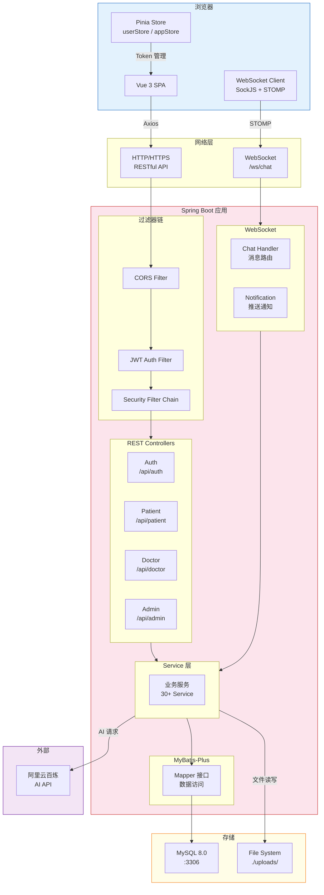
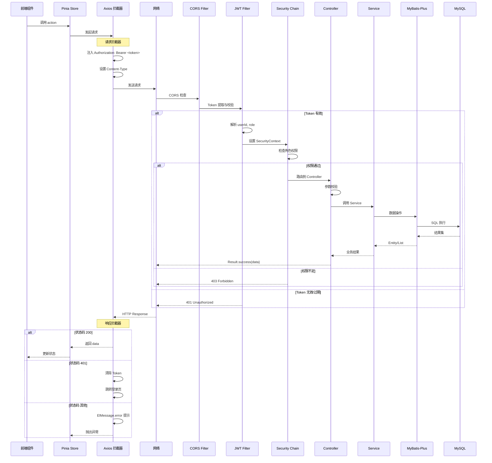
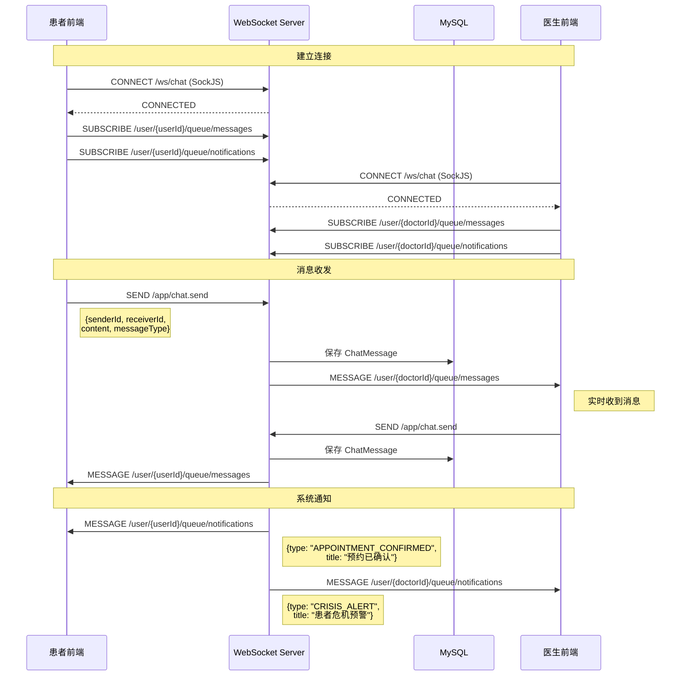
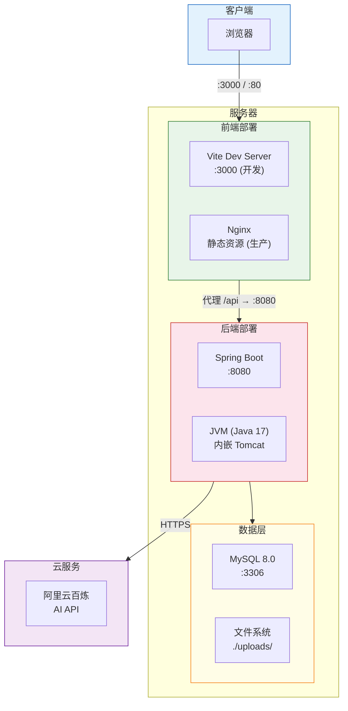
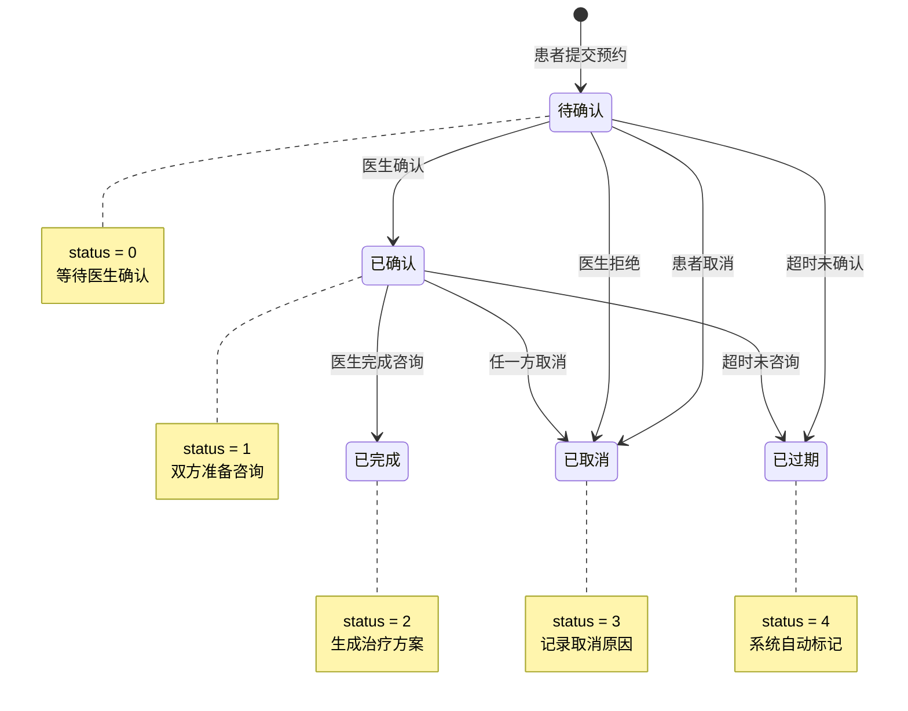
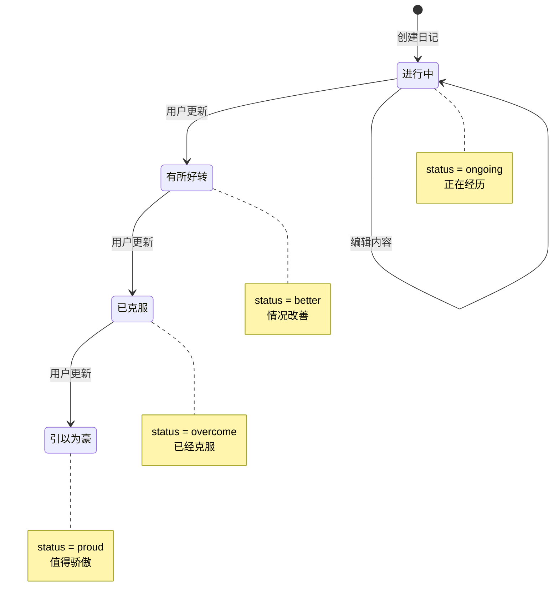
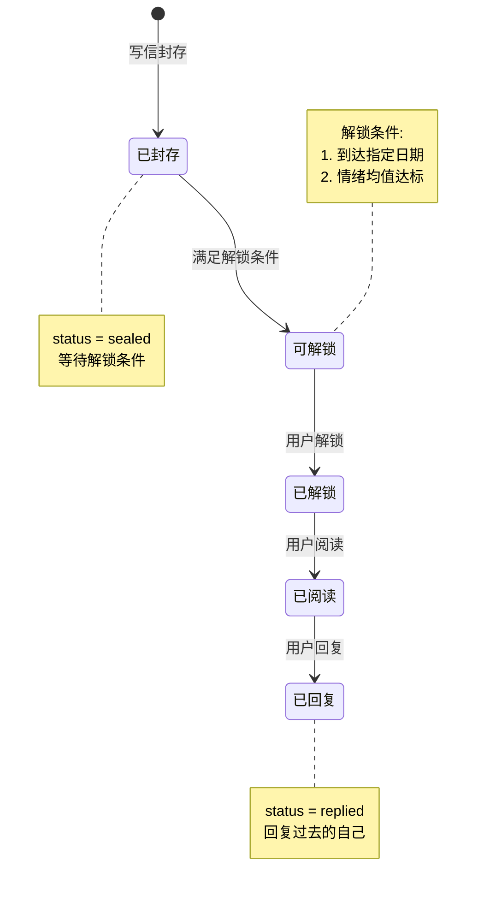

# 前后端交互与部署架构图

## 1. 前后端交互全景

```mermaid
flowchart TB
    subgraph Browser["浏览器"]
        direction TB
        Vue["Vue 3 SPA"]
        Store["Pinia Store<br/>userStore / appStore"]
        WS_Client["WebSocket Client<br/>SockJS + STOMP"]
    end

    subgraph Network["网络层"]
        HTTP["HTTP/HTTPS<br/>RESTful API"]
        WSP["WebSocket<br/>/ws/chat"]
    end

    subgraph Backend["Spring Boot 应用"]
        direction TB
        subgraph Filter["过滤器链"]
            CORSFilter["CORS Filter"]
            JWTFilter2["JWT Auth Filter"]
            SecurityChain["Security Filter Chain"]
        end

        subgraph REST["REST Controllers"]
            direction LR
            Auth2["Auth<br/>/api/auth"]
            Patient2["Patient<br/>/api/patient"]
            Doctor2["Doctor<br/>/api/doctor"]
            Admin2["Admin<br/>/api/admin"]
        end

        subgraph WS_Server["WebSocket"]
            ChatHandler["Chat Handler<br/>消息路由"]
            NotifyHandler["Notification<br/>推送通知"]
        end

        subgraph Service["Service 层"]
            BizService["业务服务<br/>30+ Service"]
        end

        subgraph Mapper["MyBatis-Plus"]
            MapperLayer["Mapper 接口<br/>数据访问"]
        end
    end

    subgraph Storage["存储"]
        DB["MySQL 8.0<br/>:3306"]
        FS["File System<br/>./uploads/"]
    end

    subgraph External["外部"]
        Ali["阿里云百炼<br/>AI API"]
    end

    Vue -->|Axios| HTTP
    Store -->|Token 管理| Vue
    WS_Client -->|STOMP| WSP

    HTTP --> CORSFilter --> JWTFilter2 --> SecurityChain
    SecurityChain --> REST
    WSP --> WS_Server

    REST --> Service
    WS_Server --> Service
    Service --> MapperLayer
    Service -->|AI 请求| Ali
    MapperLayer --> DB
    Service -->|文件读写| FS

    style Browser fill:#E3F2FD,stroke:#1565C0
    style Backend fill:#FCE4EC,stroke:#C62828
    style Storage fill:#FFFDE7,stroke:#F57F17
    style External fill:#F3E5F5,stroke:#6A1B9A
```

## 2. API 请求生命周期

```mermaid
sequenceDiagram
    participant C as 前端组件
    participant S as Pinia Store
    participant I as Axios 拦截器
    participant N as 网络
    participant CF as CORS Filter
    participant JF as JWT Filter
    participant SC as Security Chain
    participant Ctrl as Controller
    participant Svc as Service
    participant MP as MyBatis-Plus
    participant DB as MySQL

    C->>S: 调用 action
    S->>I: 发起请求

    Note over I: 请求拦截器
    I->>I: 注入 Authorization: Bearer <token>
    I->>I: 设置 Content-Type
    I->>N: 发送请求

    N->>CF: CORS 检查
    CF->>JF: Token 提取与校验

    alt Token 有效
        JF->>JF: 解析 userId, role
        JF->>SC: 设置 SecurityContext
        SC->>SC: 检查角色权限

        alt 权限通过
            SC->>Ctrl: 路由到 Controller
            Ctrl->>Ctrl: 参数校验
            Ctrl->>Svc: 调用 Service
            Svc->>MP: 数据操作
            MP->>DB: SQL 执行
            DB-->>MP: 结果集
            MP-->>Svc: Entity/List
            Svc-->>Ctrl: 业务结果
            Ctrl-->>N: Result.success(data)
        else 权限不足
            SC-->>N: 403 Forbidden
        end
    else Token 无效/过期
        JF-->>N: 401 Unauthorized
    end

    N-->>I: HTTP Response

    Note over I: 响应拦截器
    alt 状态码 200
        I-->>S: 返回 data
        S-->>C: 更新状态
    else 状态码 401
        I->>I: 清除 Token
        I->>I: 跳转登录页
    else 状态码 其他
        I->>I: ElMessage.error 提示
        I-->>S: 抛出异常
    end
```

## 3. WebSocket 实时通信

```mermaid
sequenceDiagram
    participant P as 患者前端
    participant WS as WebSocket Server
    participant DB as MySQL
    participant D as 医生前端

    Note over P,D: 建立连接
    P->>WS: CONNECT /ws/chat (SockJS)
    WS-->>P: CONNECTED
    P->>WS: SUBSCRIBE /user/{userId}/queue/messages
    P->>WS: SUBSCRIBE /user/{userId}/queue/notifications

    D->>WS: CONNECT /ws/chat (SockJS)
    WS-->>D: CONNECTED
    D->>WS: SUBSCRIBE /user/{doctorId}/queue/messages
    D->>WS: SUBSCRIBE /user/{doctorId}/queue/notifications

    Note over P,D: 消息收发
    P->>WS: SEND /app/chat.send
    Note right of P: {senderId, receiverId,<br/>content, messageType}
    WS->>DB: 保存 ChatMessage
    WS->>D: MESSAGE /user/{doctorId}/queue/messages
    Note right of D: 实时收到消息

    D->>WS: SEND /app/chat.send
    WS->>DB: 保存 ChatMessage
    WS->>P: MESSAGE /user/{userId}/queue/messages

    Note over P,D: 系统通知
    WS->>P: MESSAGE /user/{userId}/queue/notifications
    Note right of WS: {type: "APPOINTMENT_CONFIRMED",<br/>title: "预约已确认"}
    WS->>D: MESSAGE /user/{doctorId}/queue/notifications
    Note right of WS: {type: "CRISIS_ALERT",<br/>title: "患者危机预警"}
```

## 4. 部署架构

```mermaid
graph TB
    subgraph Client["客户端"]
        Browser2["浏览器"]
    end

    subgraph Server["服务器"]
        subgraph FrontendDeploy["前端部署"]
            Vite["Vite Dev Server<br/>:3000 (开发)"]
            Nginx2["Nginx<br/>静态资源 (生产)"]
        end

        subgraph BackendDeploy["后端部署"]
            SpringBoot["Spring Boot<br/>:8080"]
            JVM["JVM (Java 17)<br/>内嵌 Tomcat"]
        end

        subgraph DataDeploy["数据层"]
            MySQL3["MySQL 8.0<br/>:3306"]
            FileSystem["文件系统<br/>./uploads/"]
        end
    end

    subgraph Cloud["云服务"]
        AliCloud["阿里云百炼<br/>AI API"]
    end

    Browser2 -->|":3000 / :80"| FrontendDeploy
    FrontendDeploy -->|"代理 /api → :8080"| BackendDeploy
    BackendDeploy --> DataDeploy
    BackendDeploy -->|"HTTPS"| Cloud

    style Client fill:#E3F2FD,stroke:#1565C0
    style FrontendDeploy fill:#E8F5E9,stroke:#2E7D32
    style BackendDeploy fill:#FCE4EC,stroke:#C62828
    style DataDeploy fill:#FFFDE7,stroke:#F57F17
    style Cloud fill:#F3E5F5,stroke:#6A1B9A
```

## 5. 预约状态机

```mermaid
stateDiagram-v2
    [*] --> 待确认: 患者提交预约
    待确认 --> 已确认: 医生确认
    待确认 --> 已取消: 患者取消
    待确认 --> 已取消: 医生拒绝
    待确认 --> 已过期: 超时未确认
    已确认 --> 已完成: 医生完成咨询
    已确认 --> 已取消: 任一方取消
    已确认 --> 已过期: 超时未咨询

    note right of 待确认
        status = 0
        等待医生确认
    end note

    note right of 已确认
        status = 1
        双方准备咨询
    end note

    note right of 已完成
        status = 2
        生成治疗方案
    end note

    note right of 已取消
        status = 3
        记录取消原因
    end note

    note right of 已过期
        status = 4
        系统自动标记
    end note
```

## 6. 情绪日记状态机

```mermaid
stateDiagram-v2
    [*] --> 进行中: 创建日记
    进行中 --> 有所好转: 用户更新
    有所好转 --> 已克服: 用户更新
    已克服 --> 引以为豪: 用户更新

    进行中 --> 进行中: 编辑内容

    note right of 进行中
        status = ongoing
        正在经历
    end note

    note right of 有所好转
        status = better
        情况改善
    end note

    note right of 已克服
        status = overcome
        已经克服
    end note

    note right of 引以为豪
        status = proud
        值得骄傲
    end note
```

## 7. 时光信箱状态机

```mermaid
stateDiagram-v2
    [*] --> 已封存: 写信封存
    已封存 --> 可解锁: 满足解锁条件
    可解锁 --> 已解锁: 用户解锁
    已解锁 --> 已阅读: 用户阅读
    已阅读 --> 已回复: 用户回复

    note right of 已封存
        status = sealed
        等待解锁条件
    end note

    note left of 可解锁
        解锁条件:
        1. 到达指定日期
        2. 情绪均值达标
    end note

    note right of 已回复
        status = replied
        回复过去的自己
    end note
```
