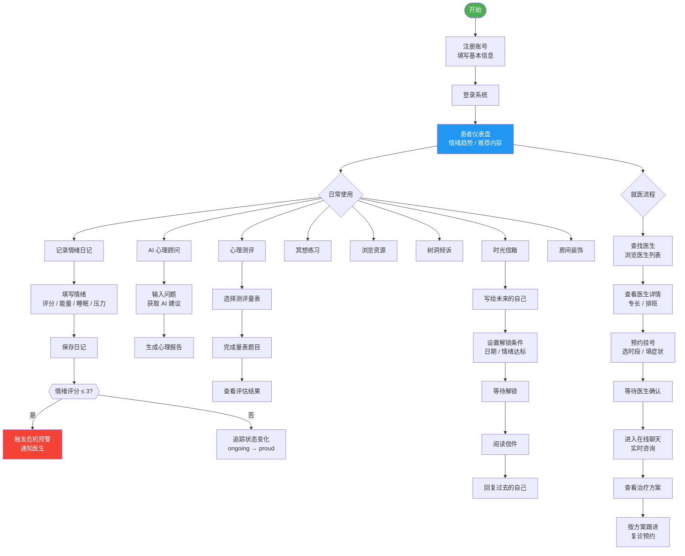
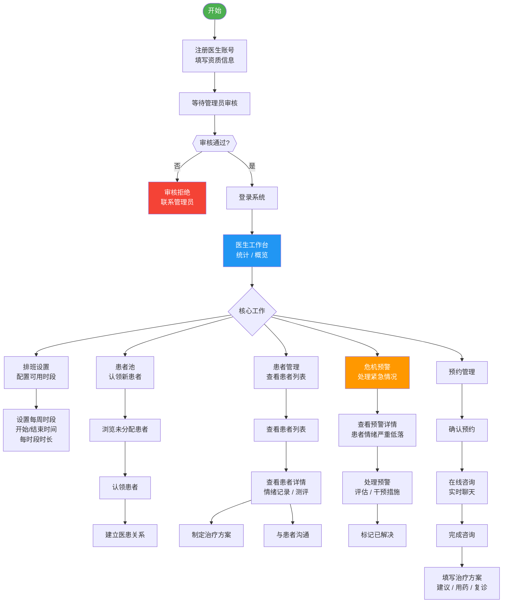
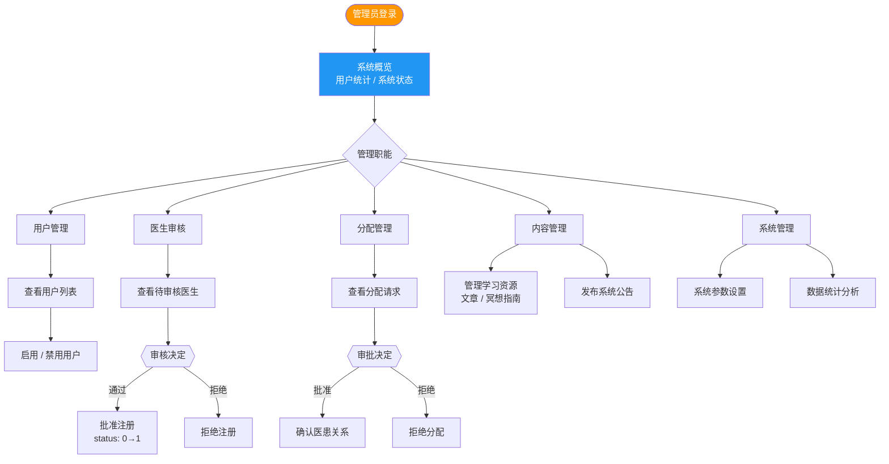
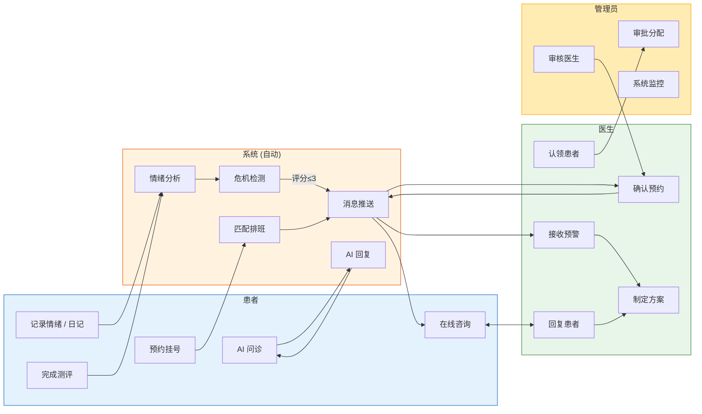

# 用户操作流程图

## 1. 患者完整使用旅程

```mermaid
flowchart TD
    Start(["开始"]) --> Register["注册账号<br/>填写基本信息"]
    Register --> Login["登录系统"]
    Login --> Dashboard["患者仪表盘<br/>情绪趋势 / 推荐内容"]

    Dashboard --> Branch1{"日常使用"}

    Branch1 --> Mood["记录情绪日记"]
    Branch1 --> AI["AI 心理顾问"]
    Branch1 --> Assess["心理测评"]
    Branch1 --> Meditate["冥想练习"]
    Branch1 --> Resource["浏览资源"]
    Branch1 --> TreeHole["树洞倾诉"]
    Branch1 --> Capsule["时光信箱"]
    Branch1 --> Room["房间装饰"]

    Mood --> MoodDetail["填写情绪<br/>评分 / 能量 / 睡眠 / 压力"]
    MoodDetail --> MoodSave["保存日记"]
    MoodSave --> MoodCheck{{"情绪评分 ≤ 3?"}}
    MoodCheck -->|是| Crisis["触发危机预警<br/>通知医生"]
    MoodCheck -->|否| MoodTrack["追踪状态变化<br/>ongoing → proud"]

    AI --> AIChat["输入问题<br/>获取 AI 建议"]
    AIChat --> AIReport["生成心理报告"]

    Assess --> ScaleSelect["选择测评量表"]
    ScaleSelect --> ScaleDo["完成量表题目"]
    ScaleDo --> ScaleResult["查看评估结果"]

    Dashboard --> Branch2{"就医流程"}

    Branch2 --> FindDoc["查找医生<br/>浏览医生列表"]
    FindDoc --> ViewDoc["查看医生详情<br/>专长 / 排班"]
    ViewDoc --> BookAppoint["预约挂号<br/>选时段 / 填症状"]
    BookAppoint --> WaitConfirm["等待医生确认"]
    WaitConfirm --> GoChat["进入在线聊天<br/>实时咨询"]
    GoChat --> ViewPlan["查看治疗方案"]
    ViewPlan --> FollowUp["按方案跟进<br/>复诊预约"]

    Capsule --> WriteLetter["写给未来的自己"]
    WriteLetter --> SetCondition["设置解锁条件<br/>日期 / 情绪达标"]
    SetCondition --> WaitUnlock["等待解锁"]
    WaitUnlock --> ReadLetter["阅读信件"]
    ReadLetter --> ReplyLetter["回复过去的自己"]

    style Start fill:#4CAF50,color:#fff
    style Crisis fill:#F44336,color:#fff
    style Dashboard fill:#2196F3,color:#fff
```

## 2. 医生完整工作流程

```mermaid
flowchart TD
    Start2(["开始"]) --> Register2["注册医生账号<br/>填写资质信息"]
    Register2 --> WaitApproval["等待管理员审核"]
    WaitApproval --> Approved{{"审核通过?"}}
    Approved -->|否| Rejected["审核拒绝<br/>联系管理员"]
    Approved -->|是| Login2["登录系统"]
    Login2 --> DDashboard["医生工作台<br/>统计 / 概览"]

    DDashboard --> Branch3{"核心工作"}

    Branch3 --> Schedule["排班设置<br/>配置可用时段"]
    Branch3 --> Pool["患者池<br/>认领新患者"]
    Branch3 --> Patients["患者管理<br/>查看患者列表"]
    Branch3 --> Alerts["危机预警<br/>处理紧急情况"]
    Branch3 --> Appointments["预约管理"]

    Schedule --> SetSlots["设置每周时段<br/>开始/结束时间<br/>每时段时长"]

    Pool --> ViewPool["浏览未分配患者"]
    ViewPool --> ClaimPatient["认领患者"]
    ClaimPatient --> NewRelation["建立医患关系"]

    Patients --> PatientList["查看患者列表"]
    PatientList --> PatientDetail["查看患者详情<br/>情绪记录 / 测评"]
    PatientDetail --> CreatePlan["制定治疗方案"]
    PatientDetail --> ChatPatient["与患者沟通"]

    Alerts --> ViewAlert["查看预警详情<br/>患者情绪严重低落"]
    ViewAlert --> HandleAlert["处理预警<br/>评估 / 干预措施"]
    HandleAlert --> ResolveAlert["标记已解决"]

    Appointments --> ConfirmAppoint["确认预约"]
    ConfirmAppoint --> Consult["在线咨询<br/>实时聊天"]
    Consult --> CompleteAppoint["完成咨询"]
    CompleteAppoint --> WritePlan["填写治疗方案<br/>建议 / 用药 / 复诊"]

    style Start2 fill:#4CAF50,color:#fff
    style Rejected fill:#F44336,color:#fff
    style DDashboard fill:#2196F3,color:#fff
    style Alerts fill:#FF9800,color:#fff
```

## 3. 管理员工作流程

```mermaid
flowchart TD
    AdminLogin(["管理员登录"]) --> ADashboard["系统概览<br/>用户统计 / 系统状态"]

    ADashboard --> Branch4{"管理职能"}

    Branch4 --> UserMgmt["用户管理"]
    Branch4 --> DoctorReview["医生审核"]
    Branch4 --> AssignMgmt["分配管理"]
    Branch4 --> ContentMgmt["内容管理"]
    Branch4 --> SystemMgmt["系统管理"]

    UserMgmt --> ViewUsers["查看用户列表"]
    ViewUsers --> ToggleStatus["启用 / 禁用用户"]

    DoctorReview --> PendingDocs["查看待审核医生"]
    PendingDocs --> ReviewDoc{{"审核决定"}}
    ReviewDoc -->|通过| ApproveDoc["批准注册<br/>status: 0→1"]
    ReviewDoc -->|拒绝| RejectDoc["拒绝注册"]

    AssignMgmt --> PendingAssign["查看分配请求"]
    PendingAssign --> ReviewAssign{{"审批决定"}}
    ReviewAssign -->|批准| ApproveAssign["确认医患关系"]
    ReviewAssign -->|拒绝| RejectAssign["拒绝分配"]

    ContentMgmt --> ManageResources["管理学习资源<br/>文章 / 冥想指南"]
    ContentMgmt --> SendMessage["发布系统公告"]

    SystemMgmt --> ConfigSettings["系统参数设置"]
    SystemMgmt --> ViewStats["数据统计分析"]

    style AdminLogin fill:#FF9800,color:#fff
    style ADashboard fill:#2196F3,color:#fff
```

## 4. 系统交互总览（角色协作）

```mermaid
flowchart LR
    subgraph 患者操作["患者"]
        P_Record["记录情绪 / 日记"]
        P_Assess2["完成测评"]
        P_Book["预约挂号"]
        P_Chat2["在线咨询"]
        P_AI2["AI 问诊"]
    end

    subgraph 系统处理["系统 (自动)"]
        S_Analyze["情绪分析"]
        S_Crisis["危机检测"]
        S_Notify["消息推送"]
        S_Match["匹配排班"]
        S_AI["AI 回复"]
    end

    subgraph 医生操作["医生"]
        D_Alert2["接收预警"]
        D_Confirm2["确认预约"]
        D_Chat3["回复患者"]
        D_Plan2["制定方案"]
        D_Claim2["认领患者"]
    end

    subgraph 管理员操作["管理员"]
        A_Review["审核医生"]
        A_Assign2["审批分配"]
        A_Monitor["系统监控"]
    end

    P_Record --> S_Analyze
    S_Analyze --> S_Crisis
    S_Crisis -->|评分≤3| S_Notify
    S_Notify --> D_Alert2
    D_Alert2 --> D_Plan2

    P_Assess2 --> S_Analyze
    P_AI2 --> S_AI
    S_AI --> P_AI2

    P_Book --> S_Match
    S_Match --> S_Notify
    S_Notify --> D_Confirm2
    D_Confirm2 --> S_Notify
    S_Notify --> P_Chat2
    P_Chat2 <--> D_Chat3
    D_Chat3 --> D_Plan2

    D_Claim2 --> A_Assign2
    A_Review --> D_Confirm2

    style 患者操作 fill:#E3F2FD,stroke:#1565C0
    style 系统处理 fill:#FFF3E0,stroke:#E65100
    style 医生操作 fill:#E8F5E9,stroke:#2E7D32
    style 管理员操作 fill:#FFECB3,stroke:#FFA000
```
